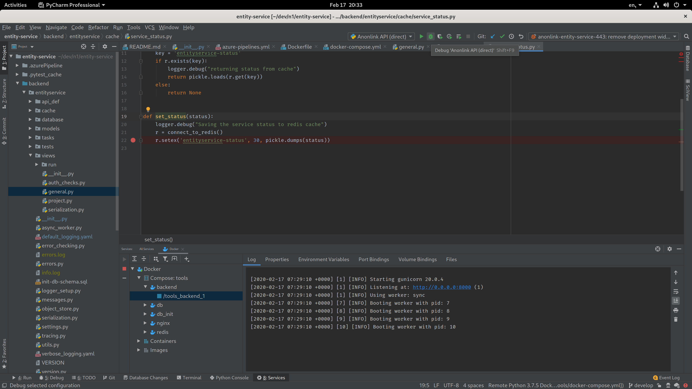

Debugging
=========

There are a few ways to debug the Anonlink Entity Service, one of the easiest ways is using docker-compose to
take care of all the dependant services.

Debugging in PyCharm
--------------------

Roughly following the JetBrains `tutorial <https://www.jetbrains.com/help/pycharm/using-docker-compose-as-a-remote-interpreter.html>`
will work with one deviation. Before debugging, launch the nginx service manually from the `docker-compose.yml` file.

The following steps through this process using PyCharm 2020.

   Debugging an Anonlink endpoint in PyCharm

Add Python Interpreter
~~~~~~~~~~~~~~~~~~~~~~

Start by adding a new Python interpreter. In new versions of PyCharm
look for the interpreter down the bottom right of the screen.

   Choose **Add Interpreter**

Make a docker-compose interpreter
~~~~~~~~~~~~~~~~~~~~~~~~~~~~~~~~~

Adding a Python interpreter from a docker-compose service is straightforward.

  
   Enter the ``tools/docker-compose.yml`` path for the configuration file and
   select ``backend`` as the service.

Manually start nginx
~~~~~~~~~~~~~~~~~~~~

Because the Anonlink Entity Service has an ``nginx`` container
in-front of the backend api we manually start nginx.

  
   Open the docker-compose file and start the nginx service manually

.. note::
    An alternative would be to expose the port from the backend.

Create a Run Configuration
~~~~~~~~~~~~~~~~~~~~~~~~~~

Create a new Python run configuration far the API. It should default to using the
docker-compose Python interpreter, add the script path to
``entityservice._init_.py``.

   A Python run configuration for running the API service.

Debug
~~~~~

Add a breakpoint and start debugging!

   Start running or debugging from PyCharm.

Visit the url in a browser (e.g. http://localhost:8851/api/v1/status) or cause the breakpoint in a notebook or separate unit test etc.
If you want the interactive terminal just click "Console" in the debugger and enjoy auto-completion etc:

   Interactive debugging console in PyCharm.

