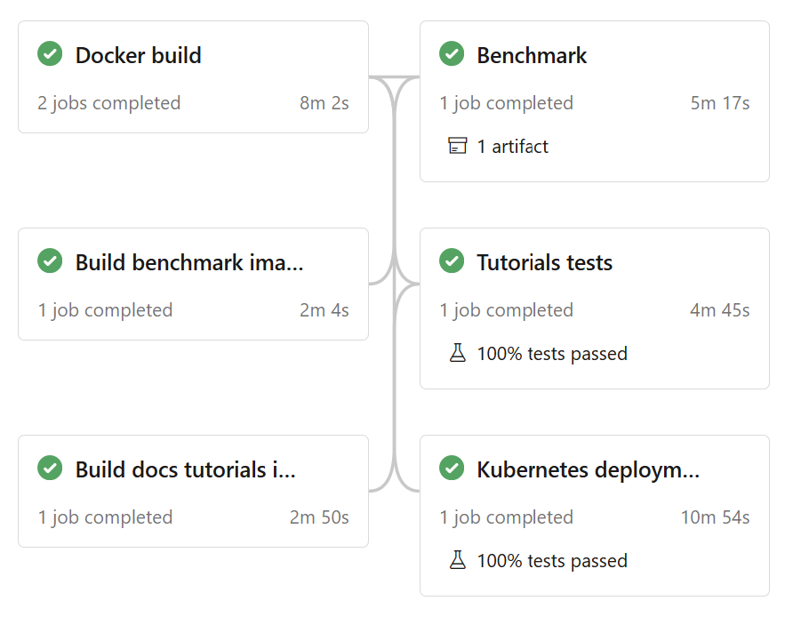

Devops
======

Continuous Integration
----------------------

Azure DevOps
~~~~~~~~~~~~

``anonlink-entity-service`` is automatically built and tested using Azure DevOps
in the project `Anonlink <https://dev.azure.com/data61/Anonlink>`.

It consists of a `build pipeline <https://dev.azure.com/data61/Anonlink/_build?definitionId=1>`.

The build pipeline is defined in the script `azure-pipelines.yml`
which uses resources from the folder `.azurePipeline`.

   Overview of CI stages showing dependencies and indicative run times.

The continuous integration stages are:

- building and pushing the following docker images:
  - the frontend ``data61/anonlink-nginx``
  - the backend ``data61/anonlink-app``
  - the tutorials ``data61/anonlink-docs-tutorials`` (used to tests the tutorial Python Notebooks)
  - the benchmark ``data61/anonlink-benchmark`` (used to run the benchmark)
- runs the benchmark using ``docker-compose`` and publishes the results as an artifact in Azure
- runs the tutorial tests using ``docker-compose`` and publishes the results in Azure
- runs the integration tests by deploying the whole service on ``Kubernetes``, running the integration
  tests and publishing the results in Azure. The pod logs are also available in Azure DevOps.

The build pipeline is triggered for every push on every branch. It is not triggered by Pull
Requests to avoid duplicate testing and building potentially untrusted external code.

The build pipeline requires two environment variables provided by Azure environment:

- `dockerHubId`: username for the pipeline to push images to Data61 dockerhub
- `dockerHubPassword`: password for the corresponding username (this is a secret variable).

It also requires a connection to a ``k8s`` cluster to be configured.

