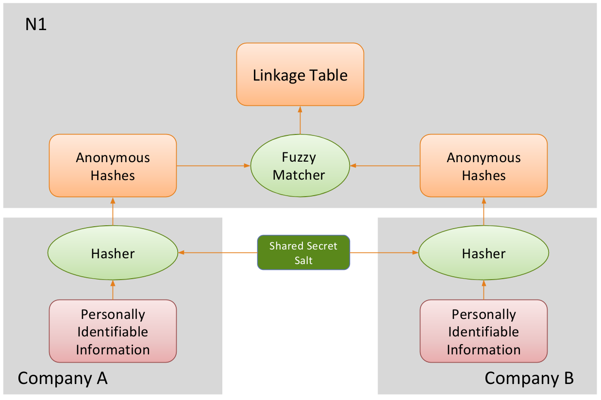

N1Analytics entity service
==========================

Allows two organizations to carry out private record linkage - without
disclosing personally identifiable information.

.. toctree::
   :maxdepth: 2
   :caption: Contents:

   api
   local-deployment
   production-deployment
   development

Each party locally hashes their entities' data (following the `hash
process <#cryptographic-longterm-keys>`__) to compute ``clks``, then
uploads to this service. The service calculates the linkage table
mapping entities to each other.

The linkage table is returned in the clear, or as a permutation and
`paillier <https://python-paillier.readthedocs.org/>`__ encrypted mask
for each party.

This service relies on the internal Python library
`anonlink <https://github.csiro.au/magic/AnonymousLinking>`__
for computing entity similarity by comparing Cryptographic Longterm Keys
(``clks``).

Matching Protocols
------------------

The Entity Service supports different **result types** which effect what
output is produced, and who may see the output.

.. warning::

   The matching protocol cannot always be enforced by the Entity Service,
   so it is important that all participants trust and verify that they are
   participating in the agreed mode.

Direct Mapping Table
~~~~~~~~~~~~~~~~~~~~

This outputs a lookup table using original indices from the two
organizations. The ``result_token`` (generated when creating the
mapping) is required. The ``result_type`` should be set to
``"mapping"``.

Permutation and Mask
~~~~~~~~~~~~~~~~~~~~

This protocol creates a random reordering for both organizations; and
creates a mask revealing where the reordered rows line up. Accessing the
mask requires the ``result_token``, and accessing the permutation
requires a ``receipt-token`` (provided to each organization when they
upload data).

The security in this result type relies on the mask remaining secret
from the data providers. Ensure the creator of the mapping can be trusted
by both data providers for this task.

Note the mask will be the length of the smaller dataset and is applied after
permuting the entities.

Permutation and Encrypted Mask
~~~~~~~~~~~~~~~~~~~~~~~~~~~~~~

Similar to **Permutation and Mask**, except the mask is encrypted using
a Paillier Public Key given when creating the mapping. The mask is
provided along with the unenencrypted permutation to each organization
with a valid ``receipt-token``.

Entity Service Implementation
-----------------------------

Components
~~~~~~~~~~

The entity service is implemented in Python and comprises the following
components:

-  A gunicorn/flask backend that implements the HTTP REST api.
-  Celery backend worker/s that do the actual work. This interfaces with
   the ``anonlink`` library.
-  An nginx frontend to reverse proxy the gunicorn/flask backend
   application.
-  A Minio object store (large files such as raw uploaded hashes, results)
-  A postgres database stores the linking metadata.
-  A redis task queue that interfaces between the flask app and the
   celery backend.

Each of these has been packaged as a docker image, however the use of an
external postgres database can be configured through environment
variables. Multiple workers can be used to distribute the work beyond
one machine - by default all cores will be used for computing similarity
scores and encrypting the mask vector.

Cryptographic Longterm Keys
---------------------------

A Cryptographic Longterm Key must be created for each entity; this
process is briefly documented here. Full details are available in the
paper: `A Novel Error-Tolerant Anonymous Linking
Code <http://www.record-linkage.de/-download=wp-grlc-2011-02.pdf>`__ by
Rainer Schnell, Tobias Bachteler, and Jörg Reiher.

The identifiers to use for record linkage are first preprocessed by
splitting into n-grams. String based features, such as name, address,
email will be split into Bigrams, and numerical values such as year of
birth will be split into Unigrams. See the section on `Identifier
Types <#identifier-types>`__ for details on how each feature might be
preprocessed - this must be agreed on between participating parties.

For example the name *John O'Shea* is split into the Bigrams: JO OH HN
OS SH HE EA.

Each n-gram for each identifier is hashed with two independent hash
functions to create the CLK. We use the two HMACs proposed in the above
paper namely HMAC-SHA1 and HMAC-MD5.

.. danger::

   Both of these HMACs take a key - it is essential that two independent
   keys are used, and that these keys are not available to any other party
   which has access to the CLK data. For instance this Entity Service.

The two HMAC results are added\* together modulo 1024, and this index in
the resulting bit array is set to 1. This is repeated 30 times per
identifier. This entire process is repeated for each entity in the
dataset.

See the `next <#bloom-filter-format>`__ section for information on how
to serialize each CLK.

.. note::

   Slightly more complex than laid out here - see the paper for
   details.

Bloom Filter Format
-------------------

The bloom filter is simply a 1024 bit array. This can easily be
represented as 128 bytes (each being an 8 bit number between 0 and 255).
We serialize by base64 encoding the raw bytes of the bit array.

An example with a 64 bit filter::

    # bloom filters binary value
    '0100110111010000101111011111011111011000110010101010010010100110'

    # which corrosponds to the following bytes
    [77, 208, 189, 247, 216, 202, 164, 166]

    # which gets base64 encoded to
    'TdC999jKpKY=\n'

As with standard Base64 encodings, a newline is introduced every 76
characters.

Identifier Types
----------------

Types of personally identifiable information that can be used to create
Bloom Filters to compute CLKs. Both sides must agree on the exact
schema, however due to the one way nature of the CLKs this service can't
actually enforce that the schema was followed.

Index column
~~~~~~~~~~~~

Won't be included in calculating the similarity.

-  ``INDEX``

Gender
~~~~~~

-  ``GENDER M or F``
-  ``GENDER freetext``

Date of Birth
~~~~~~~~~~~~~

-  ``DOB YYYY/MM/DD``
-  ``DOB YYYY``
-  ``DOB DD/MM``
-  ``DOB MM``
-  ``DOB freetext`` (e.g. "12 Jan, 1984")

Name
~~~~

-  ``NAME freetext``
-  ``NAME first last``
-  ``NAME first middle last``

Phone
~~~~~

-  ``PHONE freetext``

Address
~~~~~~~

-  ``ADDRESS_ZIPCODE``
-  ``ADDRESS_STREET_NUMBER``
-  ``ADDRESS_STREET_NAME``
-  ``ADDRESS_SUBURB``
-  ``ADDRESS_CITY``
-  ``ADDRESS_COUNTRY``

-  ``ADDRESS freetext``

