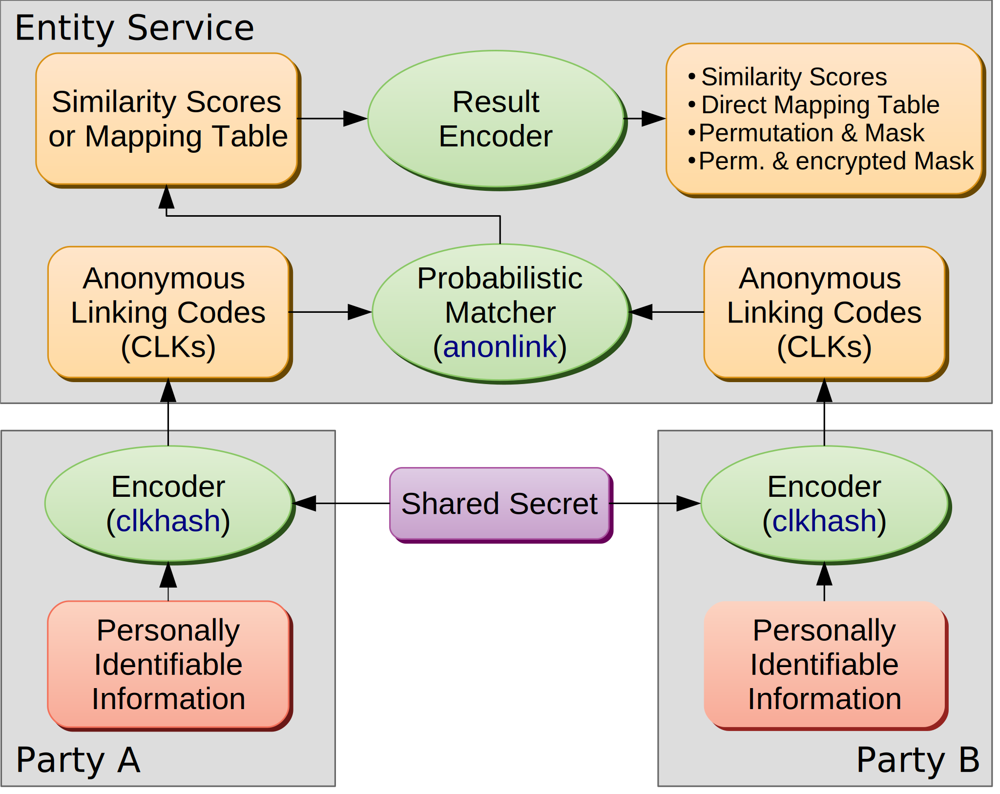

Entity Service - v\ |release|
=============================

The *Entity Service* allows two organizations to carry out private record linkage --- finding matching records of
entities between their respective datasets without disclosing personally identifiable information.

Overview
--------
The *Entity Service* is based on the concept of *Anonymous Linking Codes* (ALC). These can be seen as bit-arrays representing
an entity, with the property that the similarity of the bits of two ALCs reflect the similarity of the corresponding
entities.

An anonymous linking code that has been shown to produce good results and is widely used in practice is the so called
:ref:`*Cryptographic Longterm Key* <cryptographic-longterm-keys>`, or CLK for short.

.. note::
   From now on, we will use CLK exclusively instead of ALC, as our reference implementation of the private record
   linkage process uses CLK as anonymous linking code. The *Entity Service* is however not limited to CLKs.

   Schematical overview of the process of private record linkage using the *Entity Service*

Private record linkage - using the *Entity Service* - is a two stage process:

- First, each party locally encodes their entities' data (e.g. using the
  `clkhash <https://github.com/data61/clkhash>`_ tool to produce ``CLKs``, using `blocklib <https://github.com/data61/blocklib>`_ to group similar entities into subgroups). These ``CLKs`` are then uploaded to the service. All these tasks can be conveniently initiated by the `anonlink-client <https://github.com/data61/anonlink-client>`_ tool.

- The service then calculates the :ref:`similarity <comparing-clks>` between entities, using the probabilistic matching library
  `anonlink <https://github.com/data61/anonlink>`_. Depending on configuration, the output is returned
  as :ref:`a mapping, permutations and mask, or similarity scores <result-types>`.

API
----

`Open API <./api.html>`_

Table Of Contents
-----------------

.. toctree::
   :maxdepth: 2

   tutorial/index
   concepts
   security
   deployment
   development
   devops
   benchmarking
   logging
