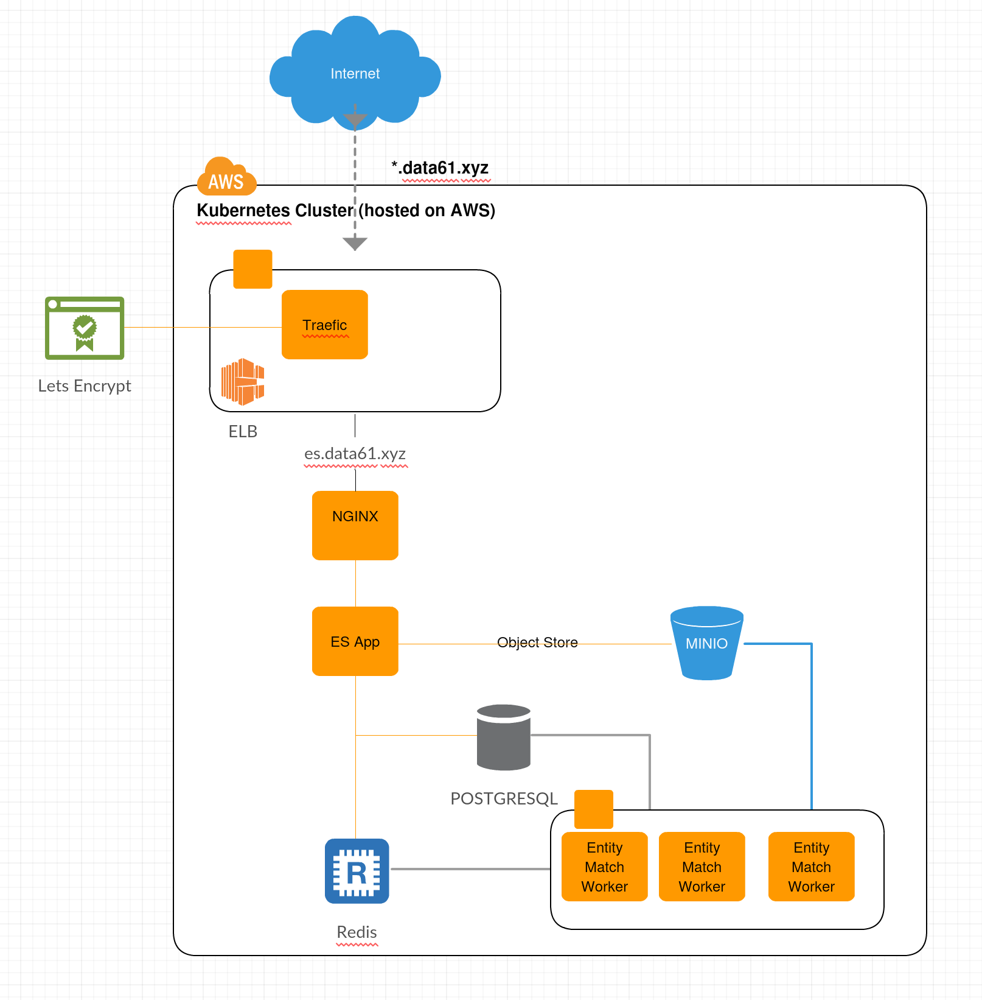

Production deployment
=====================

Production deployment assumes a `Kubernetes <https://kubernetes.io/docs/home/>`__
cluster.

The entity service has been deployed to kubernetes clusters on Azure, GCE, minikube, and
AWS. The system has been designed to scale across multiple nodes and handle node
failure without data loss.

Overview
--------

At a high level the main custom components are:

- **REST API Server** - a gunicorn/flask backend web service hosting the REST api.
- **PPRL Worker** instances - using celery for task scheduling.

The components that are used in support are:

- Postgresql database holds all match metadata
- Redis is used for the celery job queue and as a cache
- An object store (e.g. AWS S3, or Minio) stores the raw CLKs, intermediate files, and results.
- nginx provides upload buffering, request rate limiting.
- An ingress controller (e.g. nginx-ingress/traefik) provides TLS termination.

The rest of this document goes into how to deploy in a production setting.

Requirements
------------

A Kubernetes Cluster is required - creating and setting up a Kubernetes cluster is out of
scope for this documentation.

**Hardware requirements**

Recommended AWS worker `instance type <https://aws.amazon.com/ec2/instance-types/>`__
is ``r3.4xlarge`` - spot instances are fine as we handle node failure. The
number of nodes depends on the size of the expected jobs, as well as the
memory on each node. For testing we recommend starting with at least two nodes, with each
node having at least 8 GiB of memory and 2 vCPUs.

**Software to interact with the cluster**

You will need to install the `kubectl <https://kubernetes.io/docs/tasks/kubectl/install/>`__
command line tool, and `helm <https://helm.sh/>`__.

Helm
~~~~

The Anonlink Entity Service has been packaged using `helm <https://helm.sh/>`__,
follow the `helm installation documentation <https://helm.sh/docs/intro/install/>`__.

Ingress Controller
~~~~~~~~~~~~~~~~~~

For external API access the deployment relies on ``Ingress`` resources, for this to work the cluster must
have an `ingress controller <https://kubernetes.io/docs/concepts/services-networking/ingress-controllers/>`__.

Deploy the system
-----------------

**Helm** can be used to deploy the system to a kubernetes cluster. There are two options, if you would like
to deploy from the source simply run ``helm dependency update`` command from your
`deployment/entity-service` directory, otherwise (**recommended approach**) add the Data61 helm chart
repository::

    helm repo add data61 https://data61.github.io/charts
    helm repo update

Configuring the deployment
~~~~~~~~~~~~~~~~~~~~~~~~~~

Create a new blank yaml file to hold your custom deployment settings ``my-deployment.yaml``.
Carefully read through the chart's default ``values.yaml`` file and override any values in your deployment
configuration file.

At a minimum consider setting up an ingress by changing ``api.ingress``, change the number of
workers in ``workers.replicaCount`` (and ``workers.highmemory.replicaCount``), check
you're happy with the workers' cpu and memory limits in ``workers.resources``, and finally set
the credentials:

* ``global.postgresql.postgresqlPassword``
* ``redis.password`` (and ``redis-ha.redisPassword`` if provisioning redis)
* ``minio.accessKey`` and ``minio.secretKey``

Configuration of the celery workers
~~~~~~~~~~~~~~~~~~~~~~~~~~~~~~~~~~~

Celery is highly configurable and wrong configurations can lead to a number of runtime issues, such as exhausting
the number of connection the database can handle, to threads exhaustion blocking the underlying machine.

We are thus recommending some sets of attributes, but note that every deployment is different and may require its
own tweaking.

Celery is not always the best at sharing resources, we recommend deployments specify a limit of CPU resources
each worker can use, and correspondingly set the concurrency of the workers to this limit. More information is
provided directly in the ``values.yaml`` file.

Before Installation
~~~~~~~~~~~~~~~~~~~

Before installation, it is best practice to run some checks that helm provides. The first one is to execute::

    helm lint -f extraValues.yaml

Note that it uses all the default deployment values provided in the `values.yaml` file, and overwrite them 
with the given values in `extraValues.yaml`.
It should return some information if some values are missing, e.g.::

    2019/09/11 15:13:10 [INFO] Missing required value: global.postgresql.postgresqlPassword must be provided.
    2019/09/11 15:13:10 [INFO] Missing required value: minio.accessKey must be provided.
    2019/09/11 15:13:10 [INFO] Missing required value: minio.secretKey must be provided.
    ==> Linting .
    Lint OK

    1 chart(s) linted, no failures

Notes:
 - the `lint` command does not exit with a non 0 exit code, and our templates are currently failing if linting with the option `--strict`.
 - if the folder `Charts` is not deleted, the linting may throw some errors from the dependent charts if a
   value is missing without clear description, e.g. if the redis password is missing, the following error is returned from the `redis-ha` template
   because the method `b64enc` requires a non empty string, but the template does not check first if the value is empty::

     ==> Linting .
    [ERROR] templates/: render error in "entity-service/charts/redis-ha/templates/redis-auth-secret.yaml": template: entity-service/charts/redis-ha/templates/redis-auth-secret.yaml:10:35: executing "entity-service/charts/redis-ha/templates/redis-auth-secret.yaml" at <b64enc>: invalid value; expected string

    Error: 1 chart(s) linted, 1 chart(s) failed

Then, it advised to use the `--dry-run --debug` options before deploying with `helm`, which will return *all* the resources yaml descriptions.

Installation
~~~~~~~~~~~~

To install the whole system assuming you have a configuration file ``my-deployment.yaml`` in the current
directory::

    $ helm upgrade --install anonlink data61/entity-service -f anonlink.yaml

This can take several minutes the first time you deploy to a new cluster.

Run integration tests and an end to end test
--------------------------------------------

Integration tests can be carried out in the same Kubernetes cluster by creating a integration test ``Job``.
Create an ``integration-test-job.yaml`` file with the following content::

    apiVersion: batch/v1
    kind: Job
    metadata:
      name: anonlinkintegrationtest
      labels:
        jobgroup: integration-test
    spec:
      completions: 1
      parallelism: 1
      template:
        metadata:
          labels:
            jobgroup: integration-test
        spec:
          restartPolicy: Never
          containers:
          - name: entitytester
            image: data61/anonlink-app:v1.12.0
            imagePullPolicy: Always
            env:
              - name: SERVER
                value: https://anonlink.easd.data61.xyz
            command:
              - "python"
              - "-m"
              - "pytest"
              - "entityservice/tests"
              - "-x"

Update the ``SERVER`` url then create the new job on the cluster with::

    kubectl create -f integration-test-job.yaml

Upgrade Deployment with Helm
----------------------------

Updating a running chart is usually straight forward. For example if the release is called
``anonlink`` in namespace ``testing`` execute the following to increase the number of workers
to 20::

    helm upgrade anonlink entity-service --namespace=testing --set workers.replicas="20"

However, note you may wish to instead keep all configurable values in a ``yaml`` file and track
the changes in version control.

Minimal Deployment
------------------

To run with minikube for local testing we have provided a ``minimal.yaml`` configuration file that will
set small resource limits. Install the minimal system with::

    helm install entity-service --name="mini-es" --values entity-service/minimal-values.yaml

Database Deployment Options
---------------------------

At deployment time you must set the postgresql password in ``global.postgresql.postgresqlPassword``.

You can decide to deploy a postgres database along with the anonlink entity service or instead use an existing
database. To configure a deployment to use an external postgres database, simply set ``provision.postgresql``
to ``false``, set the database server in ``postgresql.nameOverride``, and add credentials to the
``global.postgresql`` section.

Object Store Deployment Options
-------------------------------

At deployment time you can decide to deploy MINIO or instead use an existing service such as AWS S3.

Note that there is a trade off between using a local deployment of minio vs S3. In our AWS based experimentation
Minio is noticeably faster, but more expensive and less reliable than AWS S3, your own mileage may vary.

To configure a deployment to use an external object store, set ``provision.minio`` to ``false`` and add
appropriate connection configuration in the ``minio`` section. For example to use AWS S3 simply provide your access
credentials (and disable provisioning minio)::

    helm install entity-service --name="es-s3" --set provision.minio=false --set minio.accessKey=XXX --set minio.secretKey=YYY --set minio.bucket=<bucket>

Redis Deployment Options
------------------------

At deployment time you can decide to provision redis using our chart, or instead use an existing redis installation or
managed service. The provisioned redis is a highly available 3 node redis cluster using the `redis-ha` helm chart.
Directly connecting to redis, and discovery via the sentinel protocol are supported. When using sentinel protocol
for redis discovery read only requests are dispatched to redis replicas.

Carefully read the comments in the ``redis`` section of the default ``values.yaml`` file.

To use a separate install of redis using the server ``shared-redis-ha-redis-ha.default.svc.cluster.local``::

    helm install entity-service --name="es-shared-redis" \
         --set provision.redis=false \
         --set redis.server=shared-redis-ha-redis-ha.default.svc.cluster.local \
         --set redis.use_sentinel=true

Uninstalling
------------

To uninstall a release called ``es`` in the default namespace::

    helm del es

Or if the anonlink-entity-service has been installed into its own namespace you can simple delete
the whole namespace with ``kubectl``::

    kubectl delete namespace miniestest

