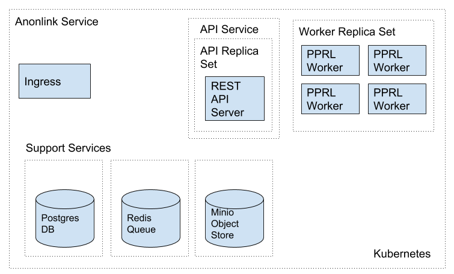

Production deployment
=====================

Production deployment assumes a multi node `Kubernetes <https://kubernetes.io/docs/home/>`__
cluster.

The entity service has been deployed to kubernetes clusters on GCE, minikube and
AWS. The system has been designed to scale across multiple nodes and handle node
failure without data loss.

At a high level the main custom components are:

- **ES App** - a gunicorn/flask backend web service hosts the REST api
- **Entity Match Worker** instances - uses celery for task scheduling

The components that are used in support are:

- postgresql database holds all match metadata
- redis is used for the celery job queue and as a cache
- (optionally) minio object store stores the raw CLKs, intermediate files, and results.
- nginx provides upload buffering, request rate limiting.
- an ingress controller (e.g. nginx-ingress/traefik) provides TLS termination

The rest of this document goes into how to deploy in a production setting.

Provision a Kubernetes cluster
------------------------------

Creating a Kubernetes cluster is out of scope for this documentation.
For AWS there is a good tutorial `here <https://github.com/coreos/kube-aws>`__.

**Hardware requirements**

Recommended AWS worker `instance type <https://aws.amazon.com/ec2/instance-types/>`__
is ``r3.4xlarge`` - spot instances are fine as we handle node failure. The
number of nodes depends on the size of the expected jobs, as well as the
memory on each node. For testing we recommend starting with at least two nodes, with each
node having at least 8 GiB of memory and 2 vCPUs.

**Software to interact with the cluster**

You will need to install the `kubectl <https://kubernetes.io/docs/tasks/kubectl/install/>`__
command line tool, and `helm <https://github.com/kubernetes/helm>`__

Cluster Storage
~~~~~~~~~~~~~~~

An existing kubernetes cluster may already have dynamically provisioned storage. If not,
create a ``default`` storage class. For AWS execute::

    kubectl create -f aws-storage.yaml

**Dynamically provisioned storage**

When pods require persistent storage this can be dynamically
provided by the cluster. The default settings (in ``values.yaml``)
assumes the existence of a ``"default"`` ``storageClass``.

For a cluster on AWS the ``aws-storage.yaml`` resource will dynamically
provision elastic block store volumes.

Install Helm
~~~~~~~~~~~~

The entity service system has been packaged using `helm <https://github.com/kubernetes/helm>`__,
there is a client program that needs to be `installed <https://github.com/kubernetes/helm/blob/master/docs/install.md>`__

At the very least you will need to install tiller into the cluster::

    helm init

Ingress Controller
~~~~~~~~~~~~~~~~~~

We assume the cluster has an ingress controller, if this isn't the case first add one. We suggest using
`Traefik <https://traefik.io/>`__ or `NGINX Ingress Controller <https://github.com/kubernetes/ingress-nginx>`__.  Both
can be installed using helm.

Deploy the system
-----------------

**Helm** can be used to easily deploy the system to a kubernetes cluster.

From the `deployment/entity-service` directory pull the dependencies:

::

    helm dependency update

Carefully read through and adjust the ``values.yaml`` file to your deployment.

At a minimum consider setting the domain by changing ``api.domain``, change the workers' cpu
and memory limits in ``workers.resources``.

To install the whole system execute::

    cd deployment
    helm install entityservice --namespace=es --name="n1entityservice"

This can take around 10 minutes the first time you deploy to a new cluster.

Run integration tests and an end to end test
--------------------------------------------

::

    kubectl create -f jobs/integration-test-job.yaml
    kubectl create -f jobs/e2e-test-job.yaml

To view the celery monitor:
---------------------------

Find the pod that the monitor is running on then forward the port:

::

    kubectl port-forward entityservice-monitor-4045544268-s34zl 8888:8888

Upgrade Deployment with Helm
----------------------------

Updating a running chart is usually straight forward. For example if the release is called ``es`` in namespace
``testing`` execute the following to increase the number of workers:

::

    helm upgrade es entity-service --namespace=testing --set workers.replicas="20"

Minimal Deployment
------------------

To run with minikube for local testing we have provided a ``minimal.yaml`` file that will
set very small resource limits. Install the minimal system with::

    helm install entity-service --name="mini-es" --values entity-service/minimal-values.yaml

Object Store Deployment Options
-------------------------------

At deployment time you can decide to deploy MINIO or instead use an existing service such as AWS S3. Note that there is
a trade off between using a local deployment of minio vs S3. Minio is noticeably faster, but both more expensive and far
less reliable than AWS S3.

To configure simple set ``provision.minio`` to ``false`` and add appropriate connection configuration in the ``minio``
section.

To use AWS S3 simply provide your access credentials and disable provisioning minio::

    helm install entity-service --name="es-s3" --set provision.minio=false --set minio.accessKey=XXX --set minio.secretKey=YYY --set minio.bucket=<bucket>

Redis Deployment Options
------------------------

At deployment time you can decide to deploy redis or instead use an existing redis installation or managed service.
Carefully read the comments in the default ``values.yaml`` file.

To use a separate install of redis using the server ``shared-redis-ha-redis-ha.default.svc.cluster.local``

    helm install entity-service --name="es-shared-redis" \
         --set provision.redis=false \
         --set redis.server=shared-redis-ha-redis-ha.default.svc.cluster.local

Uninstalling
------------

To uninstall a release called ``es``::

    helm del es

If it has been installed into its own namespace you can simple delete the whole namespace with kubectl::

    kubectl delete namespace miniestest
